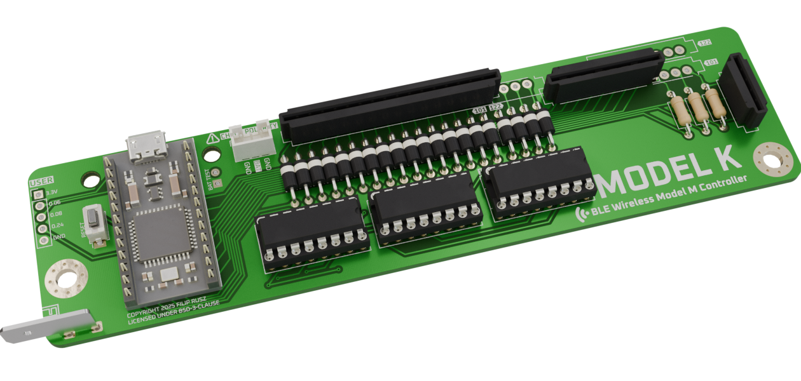

# Model M

Render may be of an outdated version, the images below are from a CI/CD render and are always up-to-date. Only compatible with nice!nano, other MCUs won't work

  
  

The Model K is a custom replacement controller designed to add BLE wireless functionality to classic IBM Model M keyboards. This controller can be hot-swapped into the original keyboard without destroying the original controller.

## Features

<!-- TODO Supported keyboards, M122 not tested yet -->
- Fully wireless with BLE (Bluetooth Low Energy)
- Battery powered with two weeks+ of battery life[^batery]
- USB C for drag-and-drop programming, charging and wired use
- Compatible with IBM Model M 101/102 layouts (122-key compatibility uncertain as I do not own one yet)[^models]
- [Open source ZMK firmware](https://github.com/3top1a/modelk-zmk), with [CI/CD builds](https://github.com/3top1a/modelk-zmk/actions/workflows/build.yml)
- Works as a shield for the [nice!nano](https://nicekeyboards.com/nice-nano), built on top of the Nordic nRF52840
- All components are THT and easy to solder/repair/replace
- Three high-frequency user-configurable pins

## Hardware

### PCB

The PCB is designed in KiCad 9. This repository has a CI/CD pipeline that automatically renders the schematic into a [PDF](https://github.com/3top1a/modelk/blob/pcb-artifacts/pcb/autogen/modelk-schematic.pdf)/[SVG](https://github.com/3top1a/modelk/blob/pcb-artifacts/pcb/autogen/modelk-schematic.svg) and generates gerbers for [JLCPCB](https://github.com/3top1a/modelk/blob/pcb-artifacts/pcb/autogen/jlcpcb.zip) and [PCBWAY](https://github.com/3top1a/modelk/blob/pcb-artifacts/pcb/autogen/pcbway.zip).

### Components

See the automatically generated [iBOM](https://github.com/3top1a/modelk/blob/pcb-artifacts/pcb/autogen/ibom.html) (you will need to download the .html file and open it in your browser for now).

For a full assembly, you will need:
- Model K PCB
- 2x 74HC595 shift register ICs, preferably with DIP-16 sockets (three for M122s)
- 3x 150R resistors for the LEDs (if you have any)
- 16x 1N4148 diodes (20 for M122s)
- 1x 6x3mm reset switch ([GME](https://www.gmelectronic.com/v/1500827/kls-ts3601-43-180-microswitch) for reference)
- A battery and its corresponding connector (on board is JST-PH 2mm and a 2.54mm pin header for power profiling)
- PCB Faston mount ([GME](https://www.gmelectronic.com/v/1500147/dj6116-63x08-faston-do-dps-63mm) for reference)
- Appropriate [Trio-mate](https://www.te.com/en/product-6-520415-6.html) or [Connfly](https://www.tme.eu/cz/details/ds1020-16st1d/konektory-ffc-fpc-raster-2-54mm/connfly/) connectors

Your keyboard might contain 16+12 or 16+8+4 connectors, make sure you order the ones you need! The board supports both of them.

> [!IMPORTANT]
> If you are using **Connfly** connectors, make sure to rotate them 180°! This sounds counter-intuitive, but **your board will not work otherwise**!

### Assembly

TODO

> [!CAUTION]
> Quadruple check the orientation of the battery! The nice!nano doesn't have reverse polarity protection and you will fry it.

## Software

For now, see the [modelk-zmk](https://github.com/3top1a/modelk-zmk) repository for the ZMK firmware.

[^batery]: currently ~2 weeks on a 400mAh battery with revision 0.3.1, will be better on newer boards

[^models]: Tested on: 1386716
