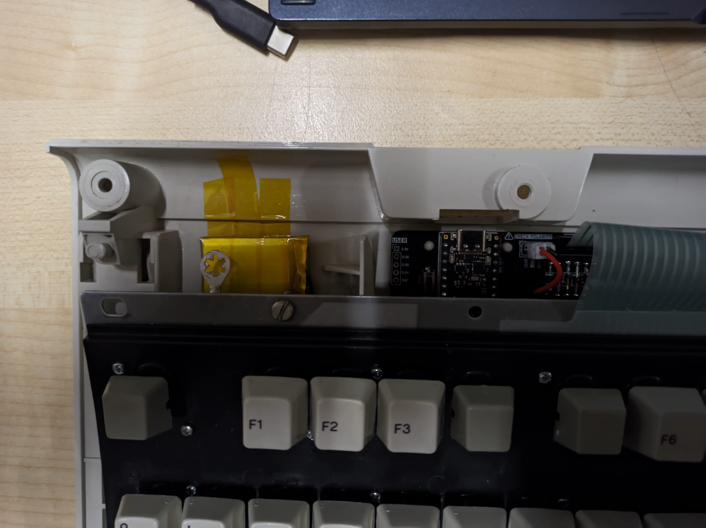

Render may be of an outdated version, the images below are from a CI/CD render and are always up-to-date. Only compatible with nice!nano, other MCUs won't work

  
  

Model K is a custom replacement controller designed to add wireless Bluetooth Low Energy functionality to classic IBM Model M keyboards. This drop-in controller lets you convert your vintage buckling spring keyboard to wireless without permanent modification, preserving the original controller.

## Features

<!-- TODO Supported keyboards, M122 not tested yet -->
- Fully wireless with BLE (Bluetooth Low Energy)
- Battery powered with 3+ weeks of battery life[^batery]
- USB C for drag-and-drop programming, charging and wired use
- Compatible with IBM Model M 101/102 layouts (122-key compatibility uncertain as I do not own one yet)[^models]
- [Open source ZMK firmware](https://github.com/3top1a/modelk-zmk), with [CI/CD builds](https://github.com/3top1a/modelk-zmk/actions/workflows/build.yml)
- Works as a shield for the [nice!nano](https://nicekeyboards.com/nice-nano), built on top of the Nordic nRF52840
- All components are THT and easy to solder/repair/replace
- Three high-frequency user-configurable pins for your solenoid/speaker desires

## Hardware

### PCB

The PCB is designed in KiCad 9. This repository has a CI/CD pipeline that automatically renders the schematic into a [PDF](https://github.com/3top1a/modelk/blob/pcb-artifacts/pcb/autogen/modelk-schematic.pdf)/[SVG](https://github.com/3top1a/modelk/blob/pcb-artifacts/pcb/autogen/modelk-schematic.svg) and generates gerbers for [JLCPCB](https://github.com/3top1a/modelk/blob/pcb-artifacts/pcb/autogen/jlcpcb.zip) and [PCBWAY](https://github.com/3top1a/modelk/blob/pcb-artifacts/pcb/autogen/pcbway.zip).

### Components

See the automatically generated [iBOM](https://github.com/3top1a/modelk/blob/pcb-artifacts/pcb/autogen/ibom.html) (you will need to download the .html file and open it in your browser for now).

For a full assembly, you will need:
- 1x Model K PCB
- 2x 74HC595 shift register ICs, preferably with DIP-16 sockets (three for M122s)
- 3x 150R resistors for the LEDs (if you have any)
- 16x 1N4148 diodes (20 for M122s)
- 1x 6x3mm reset switch ([GME](https://www.gmelectronic.com/v/1500827/kls-ts3601-43-180-microswitch) for reference)
- 1x battery and its corresponding connector (on board is JST-PH 2mm and a 2.54mm pin header for power profiling)
- PCB Faston mount ([GME](https://www.gmelectronic.com/v/1500147/dj6116-63x08-faston-do-dps-63mm) for reference)
- Appropriate [Trio-mate](https://www.te.com/en/product-6-520415-6.html) or [Connfly](https://www.tme.eu/cz/details/ds1020-16st1d/konektory-ffc-fpc-raster-2-54mm/connfly/) connectors
- 1x nice!nano with Mill Max low profile sockets

Your keyboard might contain 16+12 or 16+8+4 connectors, make sure you order the ones you need! The board supports both of them.

### Equipment

You will need:

- A Temperature-controlled soldering iron
- Some Electronics-grade solder
- Fume extraction or well-ventilated area
- A multimeter for troubleshooting
- Isopropyl alcohol for cleaning
- Kapton tape for securing the battery

### Assembly

Start with a blank PCB and solder the 16 pin connector.

On the bottom you can see the board I am assembling (revision [0.10](https://github.com/3top1a/modelk/tree/0.10)), and on the top you can see the original controller that came with my keyboard. Because I am using Connfly connectors and not the original TE Trio-mate, I need to rotate them 180° as they work differently.

> [!IMPORTANT]
> If you are using **Connfly** connectors, make sure to rotate them 180°! This sounds counter-intuitive, but **your board will not work otherwise**!

As my keyboard comes with 16+8+4 connectors, I will solder the appropriate connectors, also rotated just like the 16 pin one.

Next up are the diodes, as I have a 101-key keyboard, I will only populate the 16 left-most diodes. Pay attention to the orientation of the diodes, the black strip has to be on top, as indicated on the silkscreen.

Then the IC sockets, orientation again indicated on the silkscreen (don't forget to populate them!)

I will skip a bit here, and solder (from left to right) the Faston grounding mount, reset switch, battery connector and resistors. Just be careful soldering the Faston mount, it will get hot.

> [!CAUTION]
> Quadruple check the orientation of the battery connector! The nice!nano doesn't have reverse polarity protection and you will destroy it otherwise.

All that is left is to solder the low profile sockets, solder pins to the nice!nano (see  [official guide](https://nicekeyboards.com/docs/nice-nano/getting-started#socketing-the-nicenano)), and populate the ICs.

Here you can see the finished board (without ICs, I forgot and spent 10 minutes debugging SPI because of it), a previous iteration (revision 0.3.1) and the original controller.

Now you just need to put it into the keyboard, secure the battery with kapton tape, and mount the original grounding wire.

## Software

For now, see the [modelk-zmk](https://github.com/3top1a/modelk-zmk) repository for the ZMK firmware. Might get merged into this repository.

Installation:

- Download firmware from the modelk-zmk [CI/CD builds](https://github.com/3top1a/modelk-zmk/actions/workflows/build.yml) ([or click here for the latest firmware](https://nightly.link/3top1a/modelk-zmk/workflows/build/master/firmware.zip))
- Connect your nice!nano via USB
- Double-tap the reset button to enter bootloader mode (the little blue light should stay on)
- Your computer will detect a USB drive
- Drag and drop the firmware file (.uf2) onto this drive
- The nice!nano will disconect itself once the process is complete
- Enjoy a working wireless Model M!

My default, right alt switches to a function layer, where escape toggles USB/BT and F1-F3 toggles BT profiles, F4 clears the current BT profile, and F6-F8 controls multimedia.
You can, of course, completely redesign the layout.

## Credits

Huge kudos go to [John Hawthorn](https://www.johnhawthorn.com/) for his [Model H](https://modelh.club/) controller that inspired this project. This repo started as a fork, but now doesn't share any files.

[^batery]: currently ~3 weeks on a 400mAh battery with revision 0.3.1, will be better on newer boards

[^models]: Tested on: 1386716
